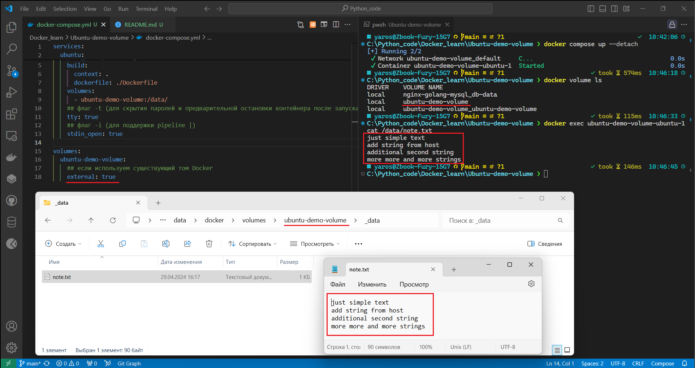
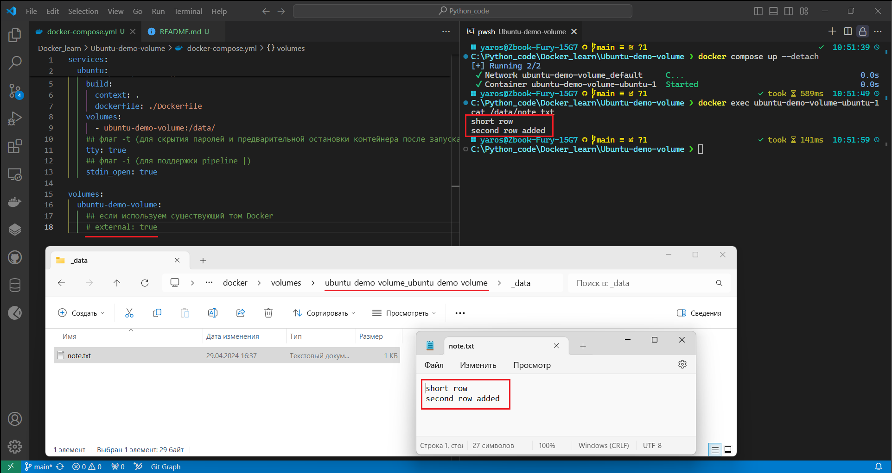

1. [Docker Docs - Compose pull_policy](https://docs.docker.com/compose/compose-file/05-services/#pull_policy)
2. [Docker Docs - Compose tty](https://docs.docker.com/compose/compose-file/05-services/#tty)
3. [Docker Docs - Compose stdin_open](https://docs.docker.com/compose/compose-file/05-services/#stdin_open)
4. [Docker Docs - Compose Build](https://docs.docker.com/compose/compose-file/build/)
5. [Docker Docs - Compose Volumes-top-level](https://docs.docker.com/compose/compose-file/07-volumes/)

### Сборка `docker compose` и аттрибут **<external: true>**

> * external: true (**TRUE**) `external` *ВКЛ*, используется **существующий docker volume**

 

> * #external: true (**FALSE**), `external` *ВЫКЛ*, будет создан **новый docker volume**. 
Даже, если <volume_name> *существует*, то будет создан новый, вида **<project_name>_<volume_name>**, где **<volume_name>** - <имя тома, вложенное в **top-level**-аттрибуте <ins>**volumes:**</ins> в {docker-compose|compose}.{y?ml}>, а **<project_name>** - имя каталога откуда собирается docker compose.

В целях эксперимента - во втором случае, том уже существовал (видно из скринов) и был наполнен вручную с внешним доступом к папке и из контейнера (для визуального отличия томов и чтобы закрепить нюанс поведения при работе volumes-top-level).

### Подробнее о tty / stdin:
[thelinuxcode.com - Первоисточник](https://thelinuxcode.com/what-is-the-docker-run-it-flag/)

* #### Enabling Interactivity with -it
    
    The `-i` and `-t` flags to docker run enable interactivity with containers:

        docker run -it ubuntu bash

    `-i` – Keep STDIN open for interactive input

    `-t` – Allocate pseudo-TTY connected to STDIN
        This connects your terminal to the container so you can provide input and see output.
     

* #### STDIN for Input Access

    The `-i` flag tells Docker to keep STDIN open. By default STDIN closes after container start. `-i` leaves it attached so you can send keyboard input to the container.

    For example, `-i` allows you to provide commands like ls, uptime, or interact with a REPL. Without `-i`, the container would not respond to input.

* #### TTY for Output Access

    `-t` allocates a pseudo-TTY that attaches your terminal to the container‘s STDIN and STDOUT. This lets you see the interactive output.

    A TTY emulates a text terminal like xterm, gnome-terminal, or iTerm2. The pseudo-TTY provides an interactive session rather than immediately exiting.

    So in summary:

    * `-i` keeps inputs open
    * `-t` enables output to terminal
    With both flags, you get full bidirectional communication with the container.